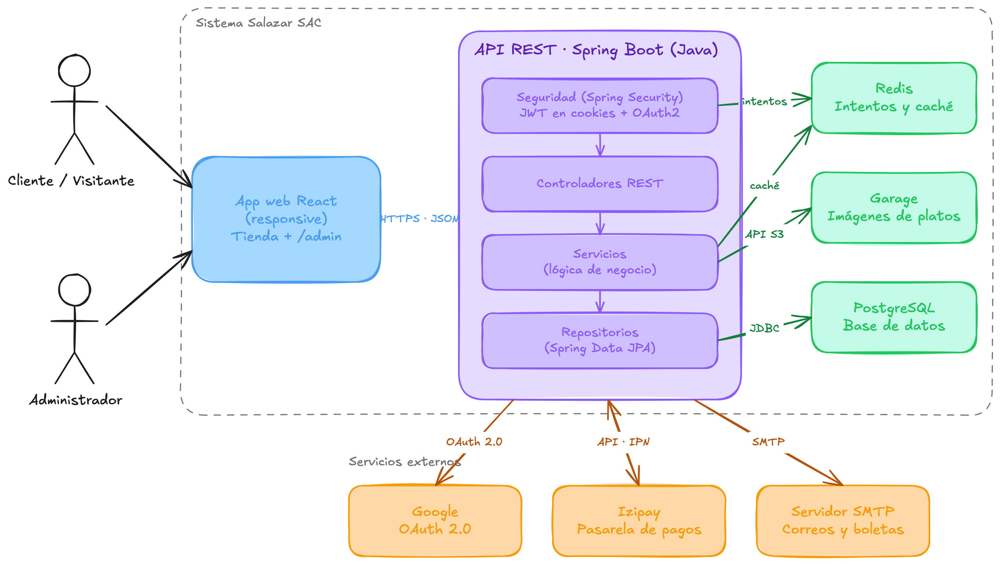

# Diagrama de arquitectura — App e-commerce Salazar SAC

## Descripción

El diagrama muestra los componentes técnicos del sistema y cómo se comunican entre ellos. Corresponde a la historia técnica **HT-05** de la épica [E0. Fundamentos del proyecto](epicas.md#e0), y concreta en infraestructura los casos de uso definidos en [diagrama-de-casos-de-uso.md](diagrama-de-casos-de-uso.md).

### Cliente (frontend)

- **App web React (responsive) — Tienda + /admin**: aplicación única que sirve tanto la tienda (catálogo, carrito y checkout de las épicas [E1](epicas.md#e1) a [E5](epicas.md#e5), HU-01 a HU-27) como el panel de administración bajo la ruta `/admin` (épica [E6](epicas.md#e6), HU-28 a HU-34). El Cliente/Visitante y el Administrador comparten el mismo artefacto frontend; es el rol del usuario autenticado el que habilita o no las vistas de `/admin`. Se comunica con la API vía HTTPS/JSON.

### API REST — Spring Boot (Java)

Backend único que atiende a la app web, organizado en capas:

- **Seguridad (Spring Security, JWT en cookies + OAuth2)**: valida sesión y roles en cada request. Sostiene el login con correo/contraseña (HU-02), la sesión persistente (HU-04), el cierre de sesión (HU-05), el login con Google vía OAuth2 (HU-06) y el acceso con rol de administrador a `/admin` (HU-28). Registra en Redis los **intentos** de autenticación, lo que permite limitar intentos fallidos de login (protección contra fuerza bruta) sin recurrir a la base de datos principal.
- **Controladores REST**: exponen los endpoints que consume la app web (catálogo, carrito, pedidos, perfil, administración), recibiendo y devolviendo JSON.
- **Servicios (lógica de negocio)**: concentran las reglas de cada épica — armado y persistencia del carrito sin cuenta (HU-12 a HU-16, HU-35), cálculo de totales (HU-14), flujo de checkout y confirmación de pedido (HU-17 a HU-22), disponibilidad/stock de platos (HU-10, HU-30) y generación de reportes de ventas (HU-34). Usan Redis como **caché** para datos de lectura frecuente (por ejemplo, el catálogo de HU-07 y HU-11), reduciendo la carga sobre PostgreSQL.
- **Repositorios (Spring Data JPA)**: acceso a datos hacia PostgreSQL vía JDBC para todas las entidades del dominio (usuarios, platos, categorías, pedidos, direcciones).

### Almacenamiento

- **PostgreSQL (base de datos)**: persiste usuarios, catálogo, carritos, pedidos y direcciones; es el modelo entidad-relación de la historia técnica HT-06. Soporta el historial de pedidos (HU-25) y el seguimiento de su estado (HU-26).
- **Garage (imágenes de platos)**: almacenamiento de objetos compatible con S3 que guarda las fotos de los platos que se muestran en el catálogo (HU-07, HU-08) y que el administrador sube o reemplaza al crear/editar un plato (HU-29). La API accede a él con el SDK de AWS S3 (HT-10); los navegadores leen las imágenes directamente de su endpoint web público.
- **Redis (intentos y caché)**: almacén en memoria de dos usos — registrar intentos de login para mitigar ataques de fuerza bruta (seguridad de HU-02) y cachear resultados de la capa de servicios para acelerar las lecturas más frecuentes del catálogo.

### Servicios externos

- **Google OAuth 2.0**: habilita el registro/login rápido con cuenta de Google (HU-06), sin manejar contraseñas propias para ese flujo.
- **Izipay (pasarela de pagos)**: procesa el pago en línea con tarjeta (HU-19) y notifica el resultado a la API (API · IPN), permitiendo informar al cliente si el pago fue rechazado (HU-22). El pago contraentrega (HU-20) no pasa por este servicio.
- **Servidor SMTP (correos y boletas)**: envía la confirmación de pedido con su número (HU-21) y los correos de recuperación de contraseña (HU-03).

### Flujo general

1. El Cliente/Visitante y el Administrador acceden únicamente a través de la misma app web React, nunca directamente a la API.
2. Toda petición pasa por la capa de seguridad antes de llegar a los controladores, servicios y repositorios.
3. Los servicios externos (Google, Izipay, SMTP) se integran solo desde la capa de servicios de la API, nunca desde el frontend, manteniendo las credenciales y la lógica de integración en el backend.
4. Redis actúa como componente de soporte transversal: la capa de seguridad lo usa para intentos de login y la capa de servicios para caché, pero ningún dato persistente vive ahí — PostgreSQL y Garage siguen siendo las únicas fuentes de verdad.
