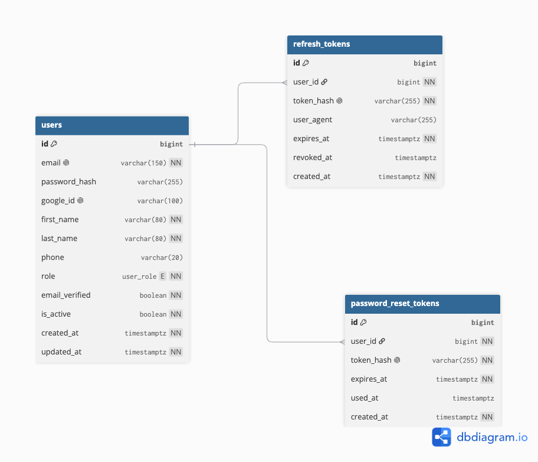

# Diagrama de base de datos — App e-commerce Salazar SAC

## Descripción

El diagrama es el modelo entidad-relación (ER) que se persiste en el contenedor **PostgreSQL** del [diagrama de despliegue](diagrama-de-despliegue.md) y que implementa la capa de **Repositorios (Spring Data JPA)** del [diagrama de arquitectura](diagrama-de-arquitectura.md). Corresponde a la historia técnica **HT-06** de la épica [E0. Fundamentos del proyecto](epicas.md#e0).

Por ahora modela únicamente el dominio de **autenticación y registro** (épica [E1](epicas.md#e1)); las tablas de catálogo, carrito, pedidos y perfil se incorporarán en iteraciones posteriores de esta misma historia técnica.

### Tablas

- **users**: cuenta de cada persona que usa el sistema, sea Cliente o Administrador.
  - `email`, `password_hash`: credenciales para el login tradicional (HU-01, HU-02).
  - `google_id`: identificador devuelto por Google OAuth2 cuando el usuario se registra/inicia sesión con Google en lugar de contraseña (HU-06).
  - `first_name`, `last_name`, `phone`: datos solicitados al registrarse (HU-01) y editables luego desde el perfil (HU-23).
  - `role` (`user_role`): distingue Cliente de Administrador, para que el panel de administración exija este rol al iniciar sesión (HU-28).
  - `email_verified`: soporta la validación del correo en el registro (HU-01).
  - `is_active`: permite desactivar una cuenta sin eliminar su historial de pedidos.
  - `created_at`, `updated_at`: trazabilidad estándar de auditoría.

- **refresh_tokens**: sesiones activas de un usuario, una fila por dispositivo/sesión.
  - `user_id`: referencia a `users`, quién es dueño de la sesión.
  - `token_hash`: valor del refresh token almacenado de forma segura (hash, no en texto plano), usado para renovar el JWT sin pedir credenciales de nuevo (HU-04, "mantener mi sesión iniciada").
  - `user_agent`: identifica el dispositivo/navegador de la sesión, útil si el cliente usa varios dispositivos.
  - `expires_at`: vencimiento natural de la sesión.
  - `revoked_at`: se marca al cerrar sesión manualmente (HU-05), invalidando el token aunque no haya expirado aún — clave para proteger la cuenta en un dispositivo compartido.

- **password_reset_tokens**: solicitudes de recuperación de contraseña (HU-03).
  - `user_id`: a quién pertenece la solicitud.
  - `token_hash`: token de un solo uso enviado por correo (vía el servidor SMTP del diagrama de despliegue) para autorizar el cambio de contraseña.
  - `expires_at`: ventana de validez del enlace de recuperación, por seguridad.
  - `used_at`: marca cuándo se consumió el token, para impedir que se reutilice.

### Relaciones

- `users (1) — (N) refresh_tokens`: un usuario puede tener varias sesiones/dispositivos activos a la vez.
- `users (1) — (N) password_reset_tokens`: un usuario puede generar varias solicitudes de recuperación a lo largo del tiempo (por ejemplo, si no completa una anterior).
