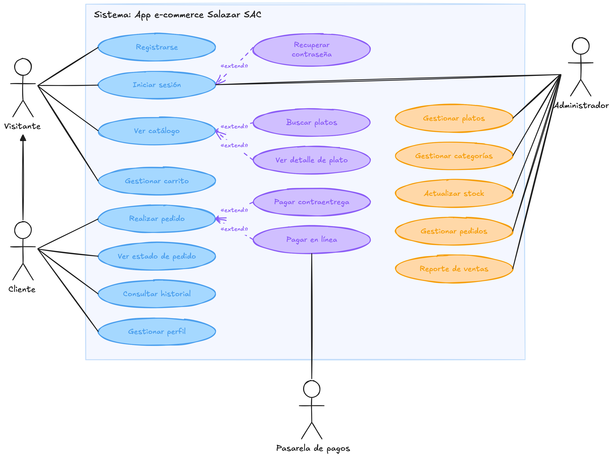

# Diagrama de casos de uso — App e-commerce Salazar SAC

## Descripción

El diagrama representa los actores y casos de uso principales del sistema, derivados de las épicas y historias definidas en [epicas.md](epicas.md) y [historias.md](historias.md).

### Actores

- **Visitante**: usuario no autenticado. Puede navegar el catálogo y armar un carrito sin necesidad de tener cuenta (épica [E3](epicas.md#e3)).
- **Cliente**: es un Visitante que se ha registrado o iniciado sesión (épica [E1](epicas.md#e1)). Hereda los casos de uso del Visitante y añade la posibilidad de completar pedidos y gestionar su cuenta.
- **Administrador**: rol interno de Salazar SAC que opera el negocio desde el panel de administración (épica [E6](epicas.md#e6)).
- **Pasarela de pagos**: sistema externo que procesa los pagos en línea con tarjeta (historia HU-19).

### Casos de uso por épica

- **Registrarse / Iniciar sesión** (E1): cubren las historias HU-01 a HU-06. "Iniciar sesión" se extiende con "Recuperar contraseña" (HU-03), ya que solo aplica cuando el cliente no puede acceder a su cuenta.
- **Ver catálogo** (E2): representa las historias HU-07 a HU-11. Se extiende con "Buscar platos" (HU-09) y "Ver detalle de plato" (HU-08), casos opcionales que ocurren solo si el cliente decide buscar o profundizar en un plato.
- **Gestionar carrito** (E3): agrupa agregar, modificar y conservar el carrito (HU-12 a HU-16, HU-35). Es accesible tanto para el Visitante como para el Cliente, ya que no requiere cuenta.
- **Realizar pedido** (E4): representa el checkout (dirección, confirmación) de las historias HU-17, HU-21 y HU-22. Se extiende con "Pagar contraentrega" (HU-20) y "Pagar en línea" (HU-19), los dos métodos de pago alternativos de la historia HU-18. "Pagar en línea" depende de la **Pasarela de pagos** como actor externo.
- **Ver estado de pedido** y **Consultar historial** (E5): corresponden a HU-26 y HU-25 respectivamente, exclusivas del Cliente porque requieren una cuenta con pedidos asociados.
- **Gestionar perfil** (E5): agrupa la edición de datos personales y direcciones (HU-23, HU-24) y repetir pedidos anteriores (HU-27).
- **Gestionar platos, Gestionar categorías, Actualizar stock, Gestionar pedidos y Reporte de ventas** (E6): son los casos de uso exclusivos del Administrador, correspondientes a las historias HU-29 a HU-34. Todos requieren el inicio de sesión del Administrador (HU-28), representado por la relación directa hacia "Iniciar sesión".

### Relaciones clave

- El Cliente **hereda** los casos de uso del Visitante (flecha de generalización), reflejando que el carrito y la navegación del catálogo no dependen de tener una cuenta, según lo definido en la épica [E3](epicas.md#e3).
- Las relaciones **«extend»** modelan comportamientos opcionales o condicionales (recuperar contraseña, buscar, ver detalle, elegir método de pago), en lugar de pasos obligatorios del flujo principal.
- El Administrador comparte el caso de uso **Iniciar sesión** con el Visitante/Cliente, ya que ambos flujos de autenticación se apoyan en el mismo mecanismo (HU-02 y HU-28).

Esta historia técnica corresponde a **HT-04** de la épica [E0. Fundamentos del proyecto](epicas.md#e0).
