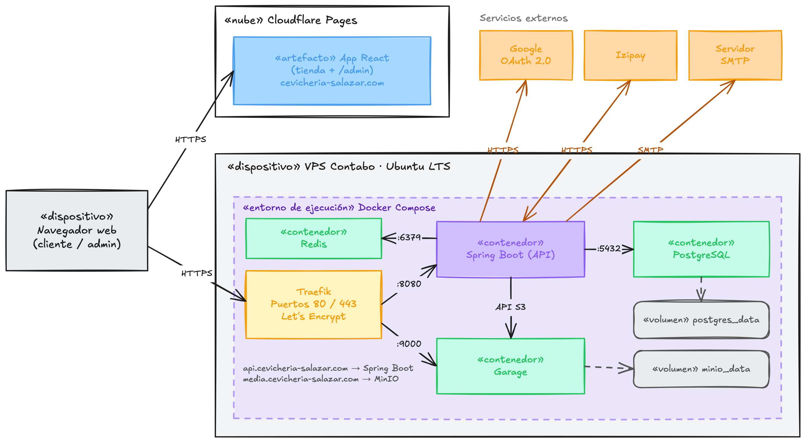

# Diagrama de despliegue — App e-commerce Salazar SAC

## Descripción

El diagrama muestra en qué infraestructura física y en qué nodos se ejecuta cada componente descrito en [diagrama-de-arquitectura.md](diagrama-de-arquitectura.md). Corresponde a la historia técnica **HT-07** de la épica [E0. Fundamentos del proyecto](epicas.md#e0), y responde a la decisión de entorno levantada en **HT-02** (hosting y estrategia de despliegue del negocio).

### Dispositivo cliente

- **Navegador web (cliente/admin)**: dispositivo del Cliente/Visitante o del Administrador. Accede por HTTPS tanto a la app React (tienda + panel) como a la API, nunca a los contenedores internos directamente.

### Cloudflare Pages («nube»)

- **App React (tienda + /admin) — cevicheria-salazar.com**: artefacto estático que empaqueta la tienda web y el panel de administración de las épicas [E1](epicas.md#e1) a [E6](epicas.md#e6). Se despliega en Cloudflare Pages para servir el frontend con baja latencia, separado del backend.

### VPS Contabo · Ubuntu LTS

Servidor propio donde corre el backend, dentro de un entorno **Docker Compose**:

- **Traefik (puertos 80/443, Let's Encrypt)**: proxy inverso y punto de entrada único del VPS. Enruta por dominio — `api.cevicheria-salazar.com` hacia Spring Boot (`:8080`) y `media.cevicheria-salazar.com` hacia el endpoint web de Garage (`:3902`) — y gestiona los certificados TLS automáticamente, para que toda comunicación con el navegador sea HTTPS.
- **Contenedor Spring Boot (API)**: ejecuta la API REST descrita en el diagrama de arquitectura (seguridad, controladores, servicios, repositorios). Atiende todas las historias de usuario que requieren backend: autenticación (HU-01 a HU-06), catálogo (HU-07 a HU-11), carrito y checkout (HU-12 a HU-22), perfil (HU-23 a HU-27) y administración (HU-28 a HU-34).
- **Contenedor Redis**: expuesto a la API en el puerto `:6379` dentro de la red de Docker Compose. Guarda los intentos de login para mitigar fuerza bruta (seguridad de HU-02) y la caché de lecturas frecuentes del catálogo (HU-07, HU-11). No tiene volumen asociado ni ruta pública en Traefik, porque su contenido es transitorio y solo lo consume la API internamente.
- **Contenedor PostgreSQL**: base de datos relacional de la API, persistida en el volumen **postgres_data** para que los datos sobrevivan a reinicios o actualizaciones del contenedor. Es la implementación física del modelo entidad-relación de **HT-06**.
- **Contenedor Garage**: almacenamiento de imágenes de platos (HU-08, HU-29), compatible con S3 y persistido en el volumen **garage_data**. La API lo usa por su API S3 (`:3900`, solo dentro de la red de Docker Compose) y Traefik expone su endpoint web (`:3902`) bajo el subdominio `media.cevicheria-salazar.com`, para servir las imágenes directamente sin pasar por la API. El bucket de imágenes tiene como alias ese dominio y habilitado el modo web (lectura pública); la escritura exige la clave de la aplicación.

### Servicios externos

- **Google OAuth 2.0**: la API llama a este servicio por HTTPS para el login/registro rápido con cuenta de Google (HU-06).
- **Izipay**: la API se comunica por HTTPS con la pasarela de pagos para procesar pagos en línea con tarjeta (HU-19) e informar pagos rechazados (HU-22).
- **Servidor SMTP**: la API envía por SMTP los correos de confirmación de pedido (HU-21) y de recuperación de contraseña (HU-03).

### Flujo de despliegue

1. El navegador del Cliente/Administrador resuelve `cevicheria-salazar.com` hacia Cloudflare Pages para obtener la app React, y `api.cevicheria-salazar.com` / `media.cevicheria-salazar.com` hacia el VPS para los datos y las imágenes.
2. Traefik recibe todo el tráfico HTTPS del VPS en los puertos 80/443, termina TLS con Let's Encrypt y enruta internamente a cada contenedor por su puerto interno (`:8080` API, `:3902` Garage).
3. Dentro de la red de Docker Compose, la API habla con PostgreSQL por el puerto `:5432`, con Garage por API S3 y con Redis por el puerto `:6379`; los dos primeros persisten en volúmenes dedicados, mientras que Redis queda en memoria y se descarta si el contenedor se reinicia.
4. Solo la API sale hacia los servicios externos (Google, Izipay, SMTP); el frontend en Cloudflare Pages nunca los contacta directamente.
